# Architecture: MIF Container -- a Data-Package-style, extensible manifest for research-harness import/export

> **Status: superseded by [ADR-0017](../../adr/0017-mif-container-instance-scoped-export-import-format.md)
> and [`feature-spec.md`](feature-spec.md).** This document is derived
> directly from the `mif-corpus-import-export` research session (60 gated
> findings, 0 falsified) and its two augment passes -- subset/partial-topic
> export boundary semantics, and OKF/Frictionless Data Package family prior
> art. It proposed the technical shape of a container format and stood in
> for both a preceding ADR and a `feature-spec.md` until they were authored;
> both now exist, and this document is retained as the design's grounding
> research record, not as the current contract -- read ADR-0017 first for the
> accepted decision and `feature-spec.md` for the M1 acceptance criteria.
>
> **Scope note:** this MIF Container format is specific to
> `research-harness-template`'s own topic export/import need. It is
> independent of, and has no reconciliation dependency on, the org-wide MIF
> Container Profile proposed in `modeled-information-format/MIF#77` --
> see ADR-0017's Context section for why the two proposals do not conflict.

## Context

The research harness has no way to move a topic -- its findings, citations,
ontology typing, concordance/relationship edges, verification verdicts, tags,
and provenance/session lineage -- between two corpus instances (two clones,
two orgs, a fork) without hand-copying files and hoping nothing referential
breaks. The `mif-corpus-import-export` research session was commissioned
to close that gap, and converged on a specific recommendation: **the
OKF/Frictionless Data Package family (`datapackage.json`, Table Schema,
Tabular/Fiscal Data Package) is the closest real, multi-portal-adopted prior
art for a MIF container manifest** -- closer than git bundle, OCI artifacts,
or npm's package-lock, each of which the corpus also evaluated and which
still contribute individual mechanisms this design borrows.

The research is equally clear that Data Package cannot be adopted wholesale.
Two of its own findings were corroborated as genuine weaknesses to avoid, not
copy:

- Its integrity model is **opt-in and weak**: a per-resource, MD5-by-default
  `hash` field checked only if the reader chooses to check it, and its
  Table Schema `foreignKeys` relational check is only enforced when a
  consumer opts in with `relations=True` at read time -- not by default
  validation
  (`finding-datapackage-relational-integrity-checked-only-opt-in-on-read`,
  `finding-datapackage-per-resource-hash-weaker-than-manifest-digest`,
  survived).
- Its own v1-to-v2 breaking change left most reference tooling unable to read
  v2 packages for months, producing hard read failures rather than graceful
  degradation --external, corroborated evidence that a schema/ontology-version
  compatibility gate at import is a hard requirement, not optional polish
  (`finding-datapackage-v1-v2-breaking-change-tooling-lag-migration-risk`,
  survived).

**Drivers**: enable lossless topic export/import between two MIF corpus
instances (the commissioning goal); make integrity and version-compatibility
checks **mandatory and fail-closed at import**, correcting the two gaps named
above; support a full topic export AND a filtered subset export (by tag,
dimension, or entity) with an explicit, named boundary-marker mechanism for
any cross-reference the subset excludes, per this topic's own converged
six-system synthesis
(`finding-mif-subset-export-boundary-marker-design-synthesis`, survived);
remain extensible to any current or future domain ontology pack without a
breaking change to the base container reader, mirroring Fiscal Data
Package's additive-only specialization pattern
(`finding-fiscal-data-package-optional-additive-domain-specialization`,
survived).

**External dependencies**: none required to build or read a container --
`jq`/`ajv-cli` (already required by `scripts/verify.sh`) are sufficient for
the reference implementation; no database, no registry, no network service.

**Placement in the four-layer architecture**: this is a new capability in
the **Harness services** layer -- the layer that already holds the flat
skills (`search`, `discover`, `lab`, `graph`, `topics`, …) operating directly
on the MIF substrate
(`docs/explanation/architecture.md`). It adds one new
**Contracts**-layer schema (`schemas/mif-container.schema.json`) and reads/
writes the same `reports/<topic>/` artifacts the existing scripts already
own (`findings/*.json`, `ontology-map.json`, `concordance.json`). It does
not touch the Engine (agents/commands) layer beyond a thin `/export`/
`/import` command pair that delegates to the new skill, matching how
`/falsify` delegates to `falsification-analyst`.

## Architecture

### Design principle: reuse the harness's own extension mechanism

The research surfaced a direct structural match between OKF's profile
composition pattern and a mechanism this repo already has, independently,
for a different purpose. Three OKF findings establish the external pattern:

- **Tabular Data Package** is not a new format -- it is exactly three MUST
  constraints layered on top of base Data Package (>=1 resource, a
  package-level profile marker, per-resource Table Schema)
  (`finding-tabular-data-package-profile-composition-pattern`, survived).
- **Fiscal Data Package** specializes Data Package for budget/spending data
  entirely through OPTIONAL additive fields (a `columnTypes` taxonomy,
  `extraFields`, `normalize`) -- a generic reader still works unmodified
  (`finding-fiscal-data-package-optional-additive-domain-specialization`,
  survived).
- **GBIF's biodiversity community** converts domain-specific Darwin Core
  Archive downloads INTO domain-agnostic Frictionless Data Packages
  specifically to gain relational modeling and generic validation tooling --
  treating the domain-specific and domain-agnostic layers as complementary,
  not competing
  (`finding-gbif-darwin-core-frictionless-domain-agnostic-vs-specific-two-layer`,
  survived).

This is the same shape as `packs/ontologies/*/*.ontology.yaml`'s existing
`extends` field: a base layer (`mif-generic`/`mif-base`) that every topic
gets for free, plus optional domain packs layered on top via `extends`,
resolved fail-closed by `resolve-ontology.sh`
(`docs/explanation/pack-structure.md`). **The MIF Container's profile
layering is proposed to reuse this exact mechanism, not invent a second
one**: a container's manifest declares which ontology packs (and versions)
its contained findings are typed against, the same `extends` chain the
corpus already resolves today, so a container reader that understands only
the base profile can still validate structure, while a reader that also
loads the named domain packs gets full type fidelity -- directly analogous
to GBIF's two-layer precedent.

### Building blocks

- **Manifest (`mif-package.json`)** -- one per exported unit, modeled on
  `datapackage.json`'s `resources[]` array but extended with the slots Data
  Package has no native form for: ontology bindings (id + version per bound
  pack, `$schema`-style per Data Package v2's replacement of the free-text
  `profile` string), an export-scope descriptor (`full` | `incremental` |
  `subset`), a `sourceInstance` tag, and a per-resource content digest that
  is **mandatory**, not opt-in.
- **Resources** -- each entry names one packaged MIF concept (a finding, or,
  in a `corpus`-scoped container, an `ontology-map.json`/`concordance.json`
  fragment), its file path within the container, its ontology type, and its
  digest. This generalizes Data Package's `resources[]` (external path or
  inline data) with a required `mifType` discriminator, since a MIF
  container packages more than one kind of thing.
- **Export-scope resolver** -- walks each candidate finding's
  `relationships[]` and its `ontology-map.json` edges to decide, for a
  `subset` export, whether a referenced target is: (a) already inside the
  requested scope (include directly), (b) reachable via dependency closure
  (include transitively, mirroring pnpm's `--filter` graph operators and
  Nx's project-graph ordering --
  `finding-workspace-filter-dependency-closure-subset-publish`, survived),
  or (c) genuinely excluded, in which case it becomes an explicit
  `boundaryReferences[]` entry rather than being silently dropped or
  rewritten -- the W3C Concise Bounded Description / OCI-referrers pattern
  (`finding-rdf-concise-bounded-description-dangling-boundary-reference`,
  `finding-oci-referrers-dangling-subject-reference-tolerance`, both
  survived). Closure takes precedence over marking; marking is the fallback
  only when closure is not requested or not possible, per the corpus's own
  six-system synthesis
  (`finding-mif-subset-export-boundary-marker-design-synthesis`, survived).
- **Digest engine** -- SHA-256 (not Data Package's MD5-default) over each
  resource's canonical bytes, plus a manifest-level digest computed over the
  sorted list of resource digests, mirroring OCI's self-verifying,
  content-addressed manifest
  (`finding-oci-content-addressable-manifest-digest`, survived) and npm's
  SRI-enforced install
  (`finding-npm-tarball-package-integrity-subresource`, survived) --
  deliberately rejecting Data Package's opt-in, opportunistic hash check as
  a pattern to copy.
- **Import gate** -- a strict, ordered, fail-closed sequence (never a
  best-effort merge): (1) manifest schema validation, (2) per-resource
  digest verification against the manifest, (3) ontology-binding
  compatibility check against the destination corpus's cataloged packs
  (reject on version mismatch, closing the Data Package v1/v2 lesson), (4)
  idempotent upsert-by-`@id` write (never duplicate; matches the existing
  corpus-wide idempotent-import requirement
  `finding-idempotent-rerunnable-import-patterns`), (5) trigger the existing
  deterministic rebuilders (`scripts/build-graph.sh`,
  `scripts/build-topic-readme.sh`, concordance rebuild) rather than
  hand-writing derived artifacts.
- **Origin/reconciliation tagging** -- every container carries a
  `sourceInstance` identifier (namespace + optional corpus URL), separate
  from each finding's own W3C-PROV provenance, so an import can apply a
  per-field reconciliation policy (some fields, like ontology typing and
  tags, may reconcile toward a shared value; others, like verification
  verdicts and session lineage, stay origin-scoped) rather than a blanket
  merge -- DataHub's `dataPlatformInstance` pattern applied to corpus
  instances
  (`finding-datahub-platform-instance-multi-environment-identity`,
  survived). This is also the mitigation for the corpus's most-cited risk:
  failed or skipped entity resolution silently conflates distinct entities
  during a concordance merge
  (`finding-entity-resolution-failure-silent-graph-corruption-risk`,
  survived) -- origin-tagging plus an explicit confirmation step on any
  candidate `sameAs` match is the guard, not an automatic merge.

### Component view (C4 Level 3)

```mermaid
flowchart LR
  subgraph Export
    Selector["Export-scope resolver<br/>(full / incremental / subset)"]
    Closure["Closure / boundary-marker<br/>walker (relationships[],<br/>ontology-map.json)"]
    Builder["Manifest builder<br/>(mif-package.json)"]
    Digest["Digest engine<br/>(SHA-256, per-resource +<br/>manifest-level)"]
    Writer[("Container:<br/>directory or archive")]
  end

  subgraph Import
    Reader["Container reader"]
    SchemaGate["Ontology-binding<br/>compatibility gate<br/>(fail-closed)"]
    DigestGate["Digest verification gate<br/>(fail-closed)"]
    Upsert["Idempotent upsert-by-@id<br/>+ reconciliation policy"]
    Rebuild["Deterministic rebuilders<br/>(build-graph.sh,<br/>build-topic-readme.sh,<br/>concordance)"]
  end

  Src[("reports/&lt;topic&gt;/<br/>findings, ontology-map.json")]
  Dst[("Destination corpus<br/>reports/&lt;topic&gt;/")]

  Src --> Selector --> Closure --> Builder --> Digest --> Writer
  Writer --> Reader --> SchemaGate --> DigestGate --> Upsert --> Rebuild --> Dst
```

## Non-Functional Requirements

1. WHEN a container is built from any finding set, THE SYSTEM SHALL compute
   its manifest-level digest over the sorted, canonicalized list of
   per-resource digests, so two independently-built containers over
   identical inputs SHALL produce a byte-identical manifest digest
   (determinism, matching the harness's existing "rebuild deterministically
   from disk" convention for `ontology-map.json`/`concordance.json`).
2. WHEN a container is imported, THE SYSTEM SHALL verify every contained
   resource's digest against its manifest entry BEFORE writing it to
   `reports/<topic>/`, and SHALL reject the ENTIRE import on any single
   mismatch -- never a partial, resource-by-resource opportunistic check
   (the Data Package gap this design explicitly rejects).
3. WHEN a container declares an ontology binding (pack id + version) for a
   contained finding, THE SYSTEM SHALL reject import if the destination
   corpus's cataloged version is not identical or an explicitly-declared
   compatible successor -- never a silent best-effort re-typing.
4. WHEN a container is imported into a corpus that already holds some of its
   findings (matched by stable `@id`), THE SYSTEM SHALL upsert-by-`@id` and
   SHALL NOT create a duplicate finding file.
5. WHEN a subset/incremental container contains a `relationships[]` or
   `ontology-map.json` edge whose target is excluded from the bundle, THE
   SYSTEM SHALL emit an explicit `boundaryReferences[]` entry naming the
   excluded target rather than dropping or silently rewriting the edge.
6. IF a subset export's excluded reference target IS reachable within the
   requested export scope via dependency closure, THEN THE SYSTEM SHALL
   include it directly and SHALL NOT mark it as a boundary reference
   (closure takes precedence over marking).
7. WHEN a container is built for a topic bound to N domain ontology packs,
   THE SYSTEM SHALL remain structurally readable (schema-valid, digest
   -verifiable) by a container reader that has loaded ONLY the base
   `mif-generic`/`mif-base` profile, with every domain-specific field
   appearing as an optional, additively-typed extension.
8. IF the container tool encounters a manifest whose declared `profile`
   version it does not recognize, THEN THE SYSTEM SHALL fail closed with a
   named "unrecognized container profile" error rather than
   attempting best-effort parsing.

## Decision Log

### AD-1: Manifest packaging (directory + manifest vs. self-contained archive) -- Accepted

**Decision**: a container is, at minimum, a `mif-package.json` manifest plus
a directory of the resource files it names (mirroring Data Package's split
of manifest vs. resource files); an archived form (tar/zip wrapping the same
manifest+resources) is an OPTIONAL packaging convenience, not a second
format.

**Rationale**: the manifest is the contract; how it is physically
transported (loose directory, tarball, zip, git bundle carrying the same
directory) is orthogonal, matching git bundle's own precedent of being "any
means -- disk, email, USB"
(`finding-git-bundle-full-fidelity-portable-transfer`, survived). Forcing a
single archive format would add a dependency (a specific archiver) with no
correctness benefit.

**Consequence**: the reference implementation should validate a manifest
found at either `./mif-package.json` (loose) or the root of an extracted
archive, identically.

### AD-2: Integrity model (mandatory SHA-256, fail-closed at import) -- Accepted

**Decision**: every resource carries a mandatory SHA-256 digest in the
manifest, verified by default at import with no opt-in flag, and the
manifest itself carries a top-level digest over all resource digests.

**Rationale**: this is the direct, named correction of Data Package's
weakest point -- an MD5-default, per-resource `hash` field checked only
opportunistically by tooling, plus a relational-integrity check gated behind
`relations=True` at read time -- both fail-open in a mature, real-world
standard
(`finding-datapackage-relational-integrity-checked-only-opt-in-on-read`,
`finding-datapackage-per-resource-hash-weaker-than-manifest-digest`, both
survived). OCI's self-verifying manifest digest and npm's fail-closed SRI
check are the patterns to copy instead.

**Consequence**: none of the container tooling may expose a flag that
disables digest verification for a normal import path; a deliberate
`--skip-verify` escape hatch for debugging, if ever added, must be loud
(warns on stderr, never the default) and is out of scope for the initial
build.

### AD-3: Identifier strategy (no new ids minted) -- Accepted

**Decision**: the container mints no new identifiers. Every packaged
finding keeps its existing, already-deterministic `urn:mif:concept:
<namespace>:<slug>` id unchanged; the container only needs a manifest-level
identifier for the export act itself (which pack/version/scope/timestamp
produced this container), not for its contents.

**Rationale**: MIF ids are already namespace-scoped and deterministic by
convention (the corpus's own identifier-collision research corroborates
namespace-prefixed, deterministic minting as the working pattern --
Wikidata/Wikibase id-prefix namespaces, OpenLineage's mandated
deterministic namespace-isolated URNs
(`finding-openlineage-namespace-urn-determinism`, survived), RFC 9562's
UUIDv5 namespace+name hashing). Reinventing identity at the container layer
would create a second identity system to keep in sync with the first.

**Consequence / open item**: whether the manifest's OWN identifier (for the
export act) should itself be a UUIDv5 over a namespace+canonical-content
string, or a plain timestamp+random token, is deferred to whoever implements
M1 -- it does not block manifest-schema or digest-verification work and
carries no correctness risk either way, since it never doubles as a
finding's identity.

### AD-4: Subset-export boundary handling (closure-first, marker-fallback) -- Accepted

**Decision**: a subset/incremental export first attempts to include any
referenced-but-out-of-scope target via dependency-closure inclusion; only
when closure is not requested (or the target is genuinely out of the
declared scope) does the export emit an explicit `boundaryReferences[]`
marker. Silent dropping is never permitted.

**Rationale**: this is the corpus's own converged synthesis across six
independent comparable systems -- git bundle/`git filter-repo`/`subtree`,
pnpm/Nx workspace filtering, `pg_dump`/`pg-dump-filtered`, RDF Concise
Bounded Description, and OCI referrers -- which land on exactly two
strategies and never a third
(`finding-mif-subset-export-boundary-marker-design-synthesis`, survived).
`pg_dump -t`'s bare table filter is the cautionary counter-case cited in
that synthesis: it does not itself guarantee referential integrity across
excluded rows, so closure/marking logic must be owned explicitly by the
container tooling, not assumed to come free of the underlying storage.

**Consequence**: the export-scope resolver must walk BOTH `relationships[]`
(finding-to-finding edges) and `ontology-map.json` (finding-to-type edges)
before finalizing a subset manifest -- a boundary marker omitted at either
level reproduces the exact silent-drop failure this decision exists to
prevent.

### AD-5: Extensibility (reuse the ontology-pack `extends` chain) -- Accepted

**Decision**: a container's profile layering reuses the harness's existing
`extends` mechanism (`packs/ontologies/*/*.ontology.yaml`), rather than
inventing a parallel profile-composition system. The manifest declares which
ontology packs (and pinned versions) its resources are typed against; a
generic reader validates structure using only the base profile, and richer
type-fidelity validation is available to any reader that has also vendored
the named domain packs.

**Rationale**: this is the same shape OKF's own two precedents demonstrate
externally -- Tabular Data Package's thin MUST-constraint layer on base Data
Package, and Fiscal Data Package's fully additive, backward-compatible
domain specialization
(`finding-tabular-data-package-profile-composition-pattern`,
`finding-fiscal-data-package-optional-additive-domain-specialization`, both
survived) -- and GBIF's domain-specific-plus-domain-agnostic two-layer
precedent
(`finding-gbif-darwin-core-frictionless-domain-agnostic-vs-specific-two-layer`,
survived). Building a second extension mechanism when this repo already
has one, already fail-closed, already tested by `gate_m12`, would violate
this repo's own "don't reinvent the wheel" convention for no benefit.

**Consequence**: a container whose findings are typed under a domain pack
NOT enabled in `harness.config.json`'s `ontologies[]` on the destination
corpus should fail the same way `resolve-ontology.sh` already fails closed
today on an unresolvable `extends` target -- this is existing behavior to
invoke, not new behavior to build.

### AD-6: Origin tagging and reconciliation policy -- Accepted

**Decision**: every container carries a `sourceInstance` field identifying
the corpus instance that produced it, distinct from each finding's own
W3C-PROV `provenance` block. Import applies an explicit, named
reconciliation policy per field class: ontology typing and tags MAY
reconcile toward a shared value; verification verdicts and session/goal
lineage stay scoped to their origin and are never overwritten by a second
import.

**Rationale**: DataHub's `dataPlatformInstance` entity exists specifically
so multiple independently-populated metadata graphs can be told apart, and
DataHub's own multi-environment documentation states plainly that some
metadata classes should reconcile across environments while others should
not
(`finding-datahub-platform-instance-multi-environment-identity`, survived).
This is also the direct mitigation for the single most-cited migration risk
in the corpus: silent entity-resolution failure during a concordance merge,
where an automatic match on similar tags/titles conflates two distinct
entities and the error is absorbed as ground truth
(`finding-entity-resolution-failure-silent-graph-corruption-risk`,
survived).

**Consequence**: any candidate concordance `sameAs`-style merge triggered by
an import MUST surface as a proposal requiring confirmation (human or a
gated check), never an automatic write -- the same discovery-vs-confirmed
philosophy the ontology engine's `suggest_type` already follows
(`docs/proposals/ontology-engine/ai-architecture-doc.md`).

### AD-7: Implementation surface (shell/jq skill vs. a new mif-rh-cli subcommand) -- Deferred

Two viable homes for the reference implementation:

- **A new Harness-services skill + scripts**
  (`scripts/mif-container-export.sh` / `-import.sh`, wrapped by a `/export`/
  `/import` command pair), matching the existing pattern for `search`,
  `discover`, `lab`, `graph`, `topics`. Manifest construction is a one-pass
  fold over an already-selected finding set (not the per-finding
  yq+jq+ajv-subprocess-per-file pattern that made `ontology-review.sh` slow
  enough to justify a compiled engine, ADR-0014) -- `jq`/`ajv-cli`, already
  required by `scripts/verify.sh`, are sufficient.
- **New subcommands on the existing `mif-rh-cli` engine** (ADR-0016 already
  made it a hard, attested dependency for classification), so
  export/import become `mif-rh export`/`mif-rh import` alongside `resolve`/
  `review`.

**Recommendation, not forced by this document**: start with the
shell/skill path for M1 (manifest schema + digest verification against a
real topic), since nothing in the measured research indicates an
export/import performance problem analogous to the one that justified the
compiled engine (ADR-0014's driver was 20+ minutes of per-finding subprocess
spawning across a 4,300-finding corpus; a single-topic container build is a
bounded, one-pass operation over a pre-selected set). If a future corpus
scale or a cross-instance bulk-migration use case demonstrates a real
bottleneck, migrating the manifest-build/verify logic into `mif-rh-cli` as
new subcommands is a natural M2, not a redesign -- the manifest schema and
CLI argument shape proposed here do not need to change either way.
